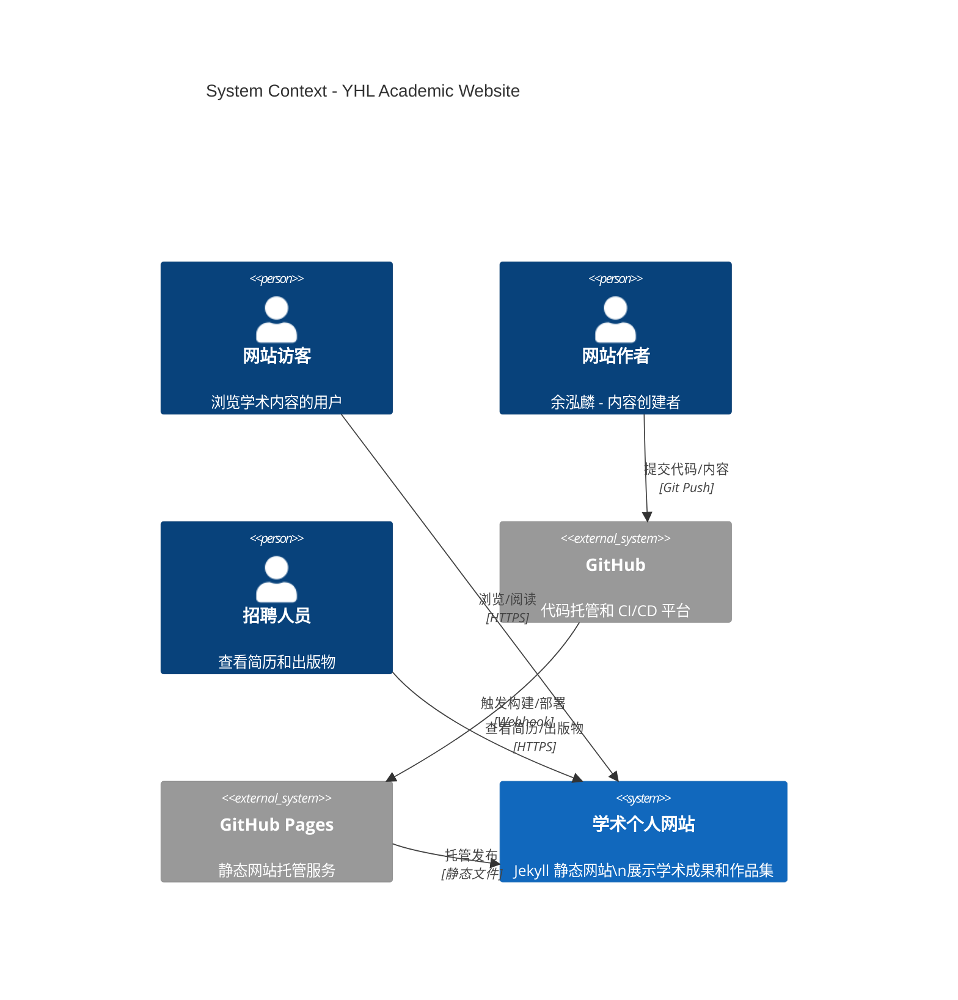
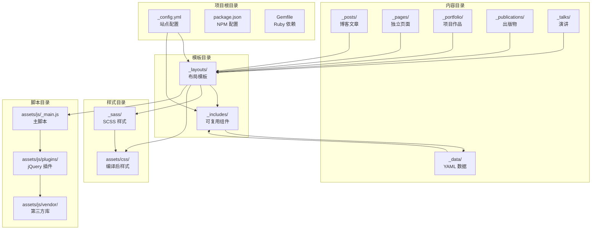
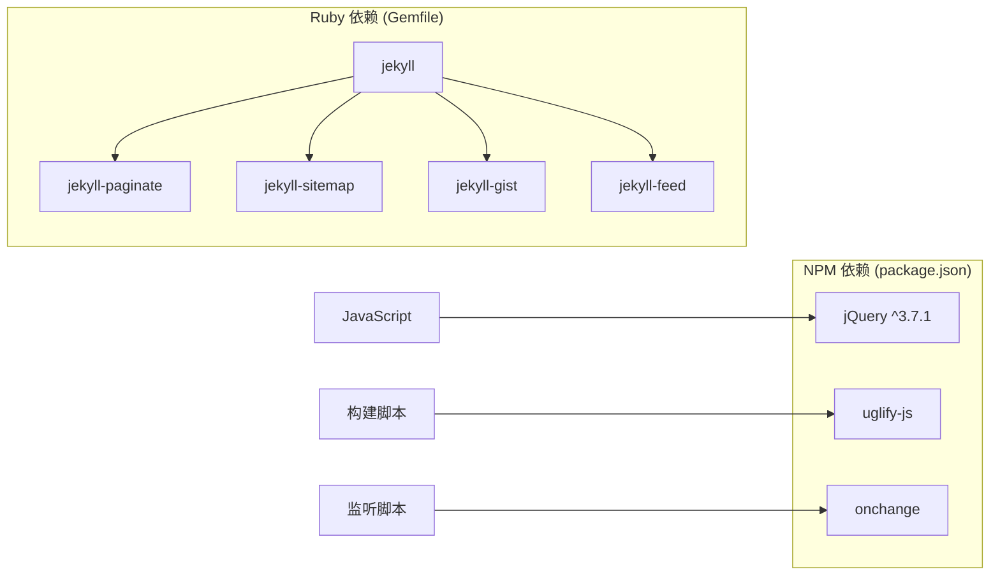
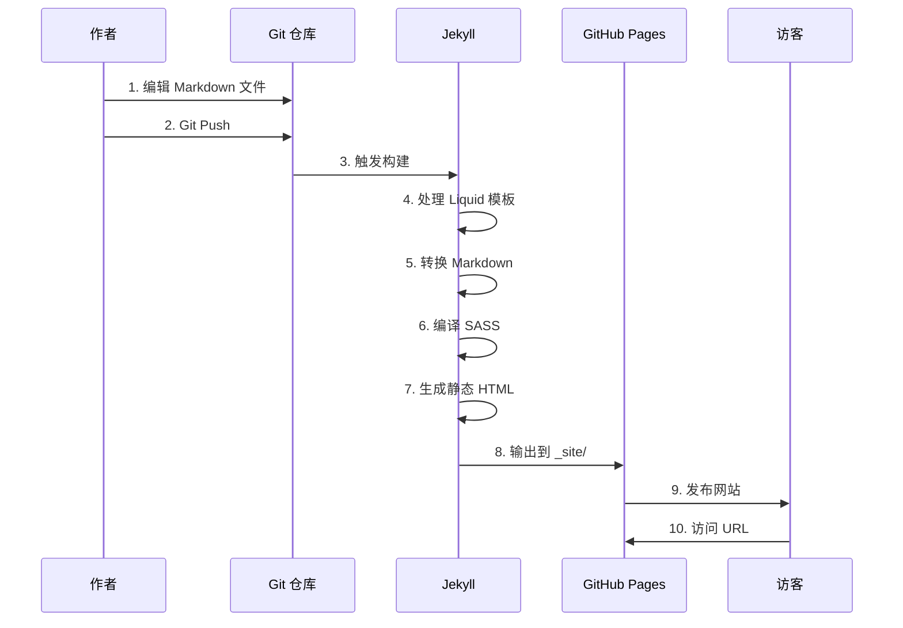

# YHL.github.io - C4 Architecture Diagrams

本文档使用 C4 模型展示项目的架构设计。

---

## Level 1: System Context（系统上下文图）

系统上下文图展示了个人网站系统与外部用户和系统之间的关系。



### 说明
- **网站访客**: 通过 HTTPS 访问网站浏览学术内容
- **网站作者**: 通过 Git 向 GitHub 提交代码和内容更新
- **招聘人员**: 访问网站查看简历、出版物和项目作品
- **GitHub**: 托管源代码，通过 Webhook 触发 GitHub Pages 构建
- **GitHub Pages**: 自动构建 Jekyll 网站并托管静态文件

---

## Level 2: Containers（容器图）

容器图展示了系统的主要应用程序容器及其交互关系。

```mermaid
C4Container
    title Container Diagram - Academic Website

    Person(author, "网站作者", "创建和编辑内容")

    Container_Bd(repo, "Git 仓库", "Jekyll 源代码\nMarkdown 内容文件", "Ruby/Jekyll")
    Container(jekyll, "Jekyll 构建引擎", "静态站点生成器\n处理 Liquid 模板", "Ruby")
    Container(site, "静态网站", "HTML/CSS/JS\n学术内容展示", "Web Browser")

    ContainerDb(posts, "博客文章", "_posts/\nMarkdown 文件", "文件系统")
    ContainerDb(publications, "出版物", "_publications/\nMarkdown 文件", "文件系统")
    ContainerDb(portfolio, "作品集", "_portfolio/\nMarkdown 文件", "文件系统")
    ContainerDb(talks, "演讲", "_talks/\nMarkdown 文件", "文件系统")

    Rel(author, repo, "编辑/提交", "Git")
    Rel(repo, jekyll, "触发构建", "GitHub Action")
    Rel(jekyll, posts, "读取", "文件系统")
    Rel(jekyll, publications, "读取", "文件系统")
    Rel(jekyll, portfolio, "读取", "文件系统")
    Rel(jekyll, talks, "读取", "文件系统")
    Rel(jekyll, site, "生成", "静态文件")
```

### 容器说明

| 容器 | 技术栈 | 描述 |
|------|--------|------|
| Git 仓库 | Jekyll + Liquid | 存储源代码和 Markdown 内容 |
| Jekyll 构建引擎 | Ruby | 处理模板、转换 Markdown、生成静态 HTML |
| 静态网站 | HTML/CSS/JS/jQuery | 最终生成的可访问网站 |

### 数据存储

| 存储 | 内容 |
|------|------|
| 博客文章 (_posts/) | 技术博客文章 |
| 出版物 (_publications/) | 学术出版物列表 |
| 作品集 (_portfolio/) | 项目作品展示 |
| 演讲 (_talks/) | 学术演讲和报告 |

---

## Level 3: Components（组件图）

组件图展示了 Jekyll 网站内部的主要组件结构。

```mermaid
C4Component
    title Component Diagram - Jekyll Site Structure

    Container_Bd(site, "静态网站", "Jekyll 生成的网站")

    Component(config, "配置层", "_config.yml\n站点配置")
    Component(layouts, "布局模板", "_layouts/\n页面布局")
    Component(includes, "可复用组件", "_includes/\n页面片段")
   Component(data, "数据文件", "_data/\nYAML 数据")

    Component(collections, "内容集合", "Collections\nposts/portfolio/talks/publications")
    Component(pages, "独立页面", "_pages/\nabout/cv/etc")
   Component(assets, "静态资源", "assets/\nCSS/JS/Images")

    Component(sass, "样式系统", "_sass/\nSCSS 样式")
    Component(scripts, "JavaScript", "jQuery 插件\n自定义脚本")

    Rel(config, layouts, "提供配置")
    Rel(layouts, includes, "引用组件")
    Rel(includes, data, "读取数据")
    Rel(layouts, collections, "渲染内容")
    Rel(layouts, pages, "渲染页面")
    Rel(layouts, assets, "引用资源")
    Rel(sass, assets, "编译为")
    Rel(scripts, assets, "打包为")
```

### 核心组件说明

#### 1. 配置层 (_config.yml)
- 站点元数据（标题、描述、URL）
- 作者信息和社交链接
- 导航菜单配置
- Jekyll 插件和构建设置

#### 2. 布局系统 (_layouts/)
| 布局文件 | 用途 |
|----------|------|
| `default.html` | 基础布局 |
| `single.html` | 单页内容布局 |
| `archive.html` | 归档页面布局 |
| `talk.html` | 演讲页面布局 |
| `splash.html` | 专题页面布局 |

#### 3. 可复用组件 (_includes/)
| 组件目录/文件 | 功能 |
|--------------|------|
| `head/` | HTML 头部元素 |
| `footer/` | 页脚组件 |
| `author-profile.html` | 作者侧边栏 |
| `analytics-providers/` | 分析服务集成 |
| `comments-providers/` | 评论系统集成 |
| `social-share.html` | 社交分享按钮 |
| `masthead.html` | 网站头部导航 |
| `paginator.html` | 分页组件 |

#### 4. 内容集合 (Collections)
```yaml
collections:
  - posts:       # 博客文章
  - portfolio:   # 项目作品
  - publications: # 学术出版物
  - talks:       # 演讲报告
  - teaching:    # 教学经历
```

#### 5. 样式系统 (_sass/)
- `_variables.scss` - 设计变量（颜色、字体、间距）
- `_base.scss` - 基础样式
- `_layout.scss` - 布局样式
- `_components.scss` - 组件样式
- `_utilities.scss` - 工具类

#### 6. JavaScript 插件 (assets/js/plugins/)
| 插件 | 功能 |
|------|------|
| `jquery.fitvids.js` | 响应式视频 |
| `jquery.greedy-navigation.js` | 导航菜单 |
| `jquery.magnific-popup.js` | 图片灯箱 |
| `jquery.smooth-scroll.min.js` | 平滑滚动 |
| `stickyfill.min.js` | 粘性定位 |

---

## Level 4: Code（代码图）

代码图展示关键的代码文件结构和依赖关系。



### 关键代码文件说明

#### 配置文件
```
├── _config.yml          # Jekyll 主配置文件
├── package.json         # NPM 脚本配置
├── Gemfile              # Ruby 依赖
└── .gitignore           # Git 忽略规则
```

#### 数据文件 (_data/)
```
_data/
├── navigation.yml       # 导航菜单配置
├── ui-text.yml          # UI 文本国际化
├── authors.yml          # 多作者配置
└── comments/            # Staticman 评论数据
```

#### 构建流程


#### 依赖关系


---

## 技术栈总结

| 层级 | 技术 |
|------|------|
| 静态站点生成器 | Jekyll (Ruby) |
| 模板语言 | Liquid |
| Markdown 处理 | Kramdown |
| 代码高亮 | Rouge |
| CSS 预处理 | SASS/SCSS |
| JavaScript 框架 | jQuery |
| 字体图标 | Font Awesome (通过 CDN) |
| 托管平台 | GitHub Pages |
| 版本控制 | Git |
| CI/CD | GitHub Actions |

---

## 部署架构


---

## 内容管理流程



---

## 文件结构树

```
YHL.github.io/
├── _config.yml              # 站点配置
├── _data/                   # 数据文件
│   ├── navigation.yml       # 导航配置
│   ├── ui-text.yml          # UI 文本
│   └── comments/            # 评论数据
├── _drafts/                 # 草稿文章
├── _includes/               # 可复用组件
│   ├── analytics/           # 分析服务
│   ├── comments/            # 评论系统
│   ├── footer/              # 页脚
│   ├── head/                # HTML 头部
│   └── *.html               # 其他组件
├── _layouts/                # 页面布局
│   ├── default.html
│   ├── single.html
│   ├── archive.html
│   └── talk.html
├── _pages/                  # 独立页面
│   ├── about.md
│   ├── cv.md
│   └── markdown.md
├── _posts/                  # 博客文章
├── _portfolio/              # 项目作品
├── _publications/           # 出版物
├── _talks/                  # 演讲
├── _teaching/               # 教学
├── _sass/                   # SCSS 样式
│   ├── _variables.scss
│   ├── _base.scss
│   └── ...
├── assets/                  # 静态资源
│   ├── css/                 # 编译后 CSS
│   ├── js/                  # JavaScript
│   │   ├── plugins/         # jQuery 插件
│   │   ├── vendor/          # 第三方库
│   │   └── _main.js         # 主脚本
│   └── images/              # 图片
├── files/                   # 下载文件
├── images/                  # 站点图片
├── talkmap/                 # 演讲地图
├── markdown_generator/      # Markdown 生成工具
├── package.json             # NPM 配置
├── Gemfile                  # Ruby 依赖
└── README.md                # 项目说明
```

---

*本文档使用 Mermaid 图表语法，支持在 GitHub、GitLab 等平台直接渲染。*
